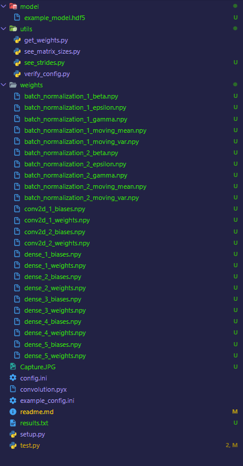

# How to run

## Versions and Packages

To run this code Python [3.6](https://www.python.org/downloads/release/python-3611/) or [3.7](https://www.python.org/downloads/release/python-378/) with the following packages is needed:

* [Numpy==1.20.2](https://pypi.org/project/numpy/1.20.2/)
* [Tensorflow==1.14.0](https://pypi.org/project/tensorflow/1.14.0/)
* [Keras==2.2.4](https://pypi.org/project/keras/2.2.4/)
* [h5py==2.10.0](https://pypi.org/project/h5py/2.10.0/)
* [Cython==0.29.23](https://pypi.org/project/cython/0.29.23/)

## Model and Weights

This CNN is only built for classification not for training, so we need to include the [model](./model) and [network variables](.weights) in their respective folders.
* Currently the algorithm is only prepared to receive a tensorflow model (.h5py).
* The file [get_weights](./utils/get_weights.py) can be used to generate the weights in the correct folder

## Setup Configuration File

The [configuration file](./config.ini) contains 4 sections
1. LOCATION:
This section relates to the location of the folder with the model, weights and to the separator used by the system

```
ModelLocation = path_to_model.hdf5
WeightsLocation = path_to_project\\weights\\ or path_to_project/weights/
Separator = \\ for windows and / for Linux or MacOs
```

2. NAMES:
This section relates to the names of the files inside the WeightsLocation defined in the previous step. An example can be seen below (-> represents the final result)

```
FirstConvolution = conv2d_1_weights
    -> path_to_project\\weights\\conv2d_1_weights
FirstConvolutionBias = conv2d_1_biases
    -> path_to_project\\weights\\conv2d_1_biases
```

3. MATRIX_SIZE

This section relates to the sizes of the matrices of the convolutional neural network. The values can be obtained from the model.summary() command or from the utils file [see_matrix_sizes](utils\see_matrix_sizes.py)

4. STRIDES

This section relates to the strides of the convolution and pooling layers of the convolutional neural network. These values can be obtained from the utils file [see_strides](utils\see_strides.py)

## Example Final Configuration

An example of a final configuration file can be found in the [example_config](example_config.ini) file.
We would advise not changing this file so it can be consulted at any time 

## Example

If everything was done properly everything should be as followed



## Compilation

After finishing the configuration the next step is to compile our cython file. Since the files cython generates depend on the operative system these need to be compiled by the user. But stress not this isn't difficult, all it is needed is to run the following line:

``` console
python .\setup.py build_ext --inplace
```

Ensure the python console is running everything in the folder where [setup](./setup.py) and [convolution](./convolution.pyx) are present.
The final result should MOST LIKELY include a C file and a .pyd or .so file. To test if everything is correct we can run the [test](test.py) file

